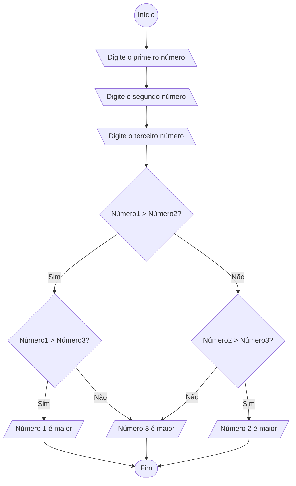

```mermaid
    flowchart TD
    start((Início)) --> input1[\Digite o primeiro número\]
    input1 --> input2[\Digite o segundo número\]
    input2 --> input3[\Digite o terceiro número\]
    input3 --> verification1{Número1 > Número2?}
    verification1 --> |Sim| verification2{Número1 > Número3?}
    verification1 --> |Não| verification3{Número2 > Número3?}
    
    verification2 --> |Sim| A[/Número 1 é maior/]
    verification2 --> |Não| B[/Número 3 é maior/]
    
    verification3 --> |Sim| C[/Número 2 é maior/]
    verification3 --> |Não| B

    A --> finish([Fim])
    B --> finish
    C --> finish


```