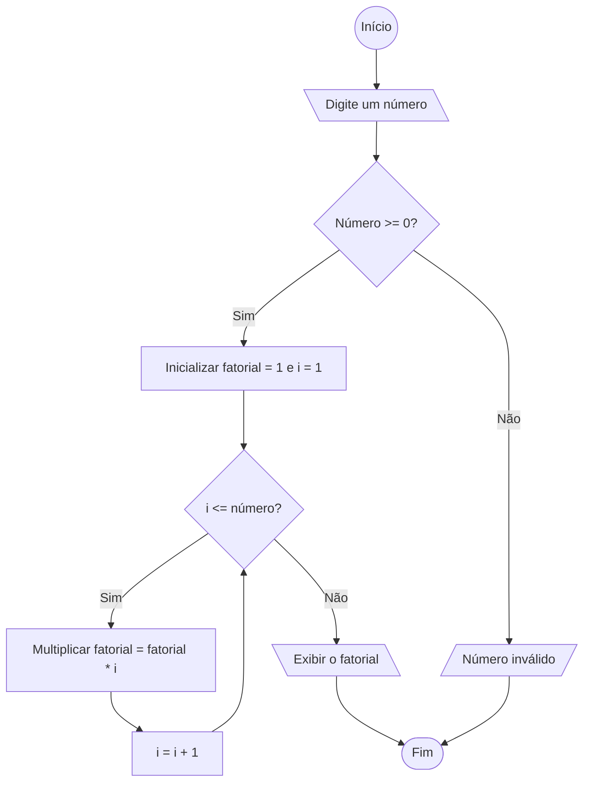

```mermaid
    flowchart TD
    start((Início)) --> input[\Digite um número\]
    input --> verification{Número >= 0?}
    verification --> |Sim| initialize[Inicializar fatorial = 1 e i = 1]
    verification --> |Não| negative[/Número inválido/]
    initialize --> loop{i <= número?}
    loop --> |Sim| process[Multiplicar fatorial = fatorial * i]
    process --> increment[i = i + 1]
    increment --> loop
    loop --> |Não| output[\Exibir o fatorial\]
    output --> finish([Fim])
    negative --> finish


```