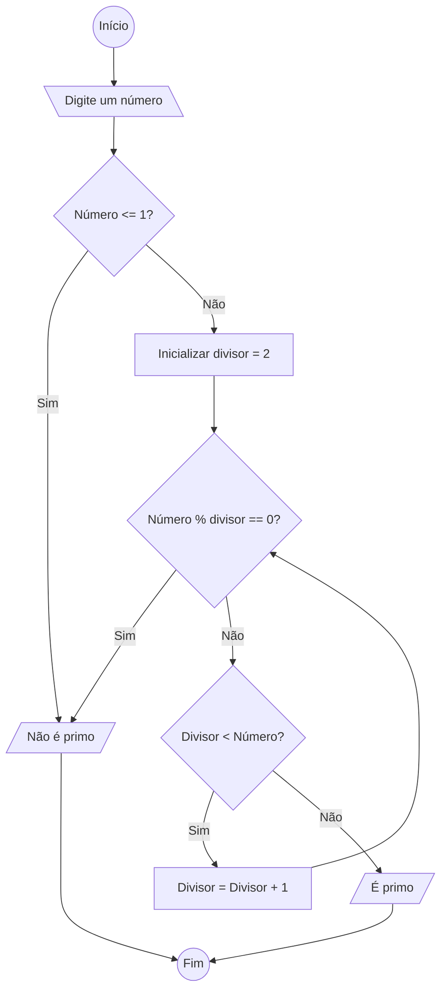

```mermaid
    flowchart TD
    inicio((Início)) --> entrada[\Digite um número\]
    entrada --> verifica{Número <= 1?}
    verifica --> |Sim| naoPrimo[/Não é primo/]
    verifica --> |Não| inicializa[Inicializar divisor = 2]
    inicializa --> loop{Número % divisor == 0?}
    loop --> |Sim| naoPrimo
    loop --> |Não| verificaDiv{Divisor < Número?}
    verificaDiv --> |Sim| incrementa[Divisor = Divisor + 1]
    verificaDiv --> |Não| primo[/É primo/]
    incrementa --> loop
    primo --> fim((Fim))
    naoPrimo --> fim

```